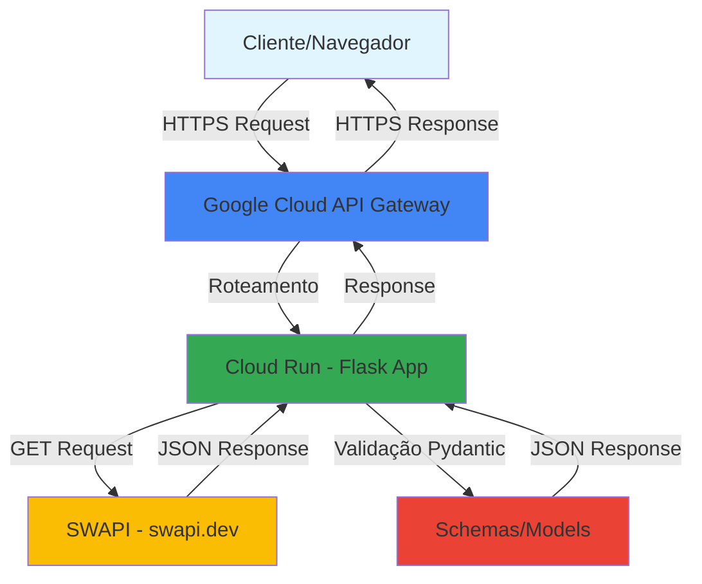

# 🌌 Galactic Codex API


API REST desenvolvida em Python com Flask que consome dados da SWAPI (Star Wars API) e fornece informações sobre o universo Star Wars de forma estruturada e simplificada.

## 📋 Índice

- [Sobre o Projeto](#sobre-o-projeto)
- [Arquitetura](#arquitetura)
- [Tecnologias Utilizadas](#tecnologias-utilizadas)
- [Funcionalidades](#funcionalidades)
- [Pré-requisitos](#pré-requisitos)
- [Instalação](#instalação)
- [Como Usar](#como-usar)
- [Endpoints da API](#endpoints-da-api)
- [Estrutura do Projeto](#estrutura-do-projeto)
- [Testes](#testes)
- [Deploy no Google Cloud](#deploy-no-google-cloud)

## 🎯 Sobre o Projeto

O **Galactic Codex API** é uma API RESTful que atua como intermediária entre clientes e a SWAPI (Star Wars API), proporcionando:

- ✨ Interface simplificada e padronizada para dados de Star Wars
- 🔍 Capacidade de busca em múltiplos recursos (personagens, planetas, naves, filmes)
- 📦 Validação de dados com Pydantic
- ☁️ Deploy em ambiente de produção no Google Cloud Platform
- 🚀 Alta disponibilidade através do API Gateway do GCP

## 🏗️ Arquitetura



### Fluxo de Dados

1. **Cliente** faz uma requisição HTTP para o API Gateway do Google Cloud
2. **API Gateway** roteia a requisição para a aplicação Flask no Cloud Run
3. **Flask App** recebe a requisição e chama o serviço apropriado (SwapiService)
4. **SwapiService** faz uma requisição HTTP para a SWAPI externa
5. **SWAPI** retorna os dados em JSON
6. **Pydantic Schemas** validam e estruturam os dados recebidos
7. **Flask App** retorna a resposta formatada ao cliente através do API Gateway

## 🛠️ Tecnologias Utilizadas

- **[Python 3.12+](https://www.python.org/)** - Linguagem de programação
- **[Flask](https://flask.palletsprojects.com/)** - Framework web minimalista
- **[Pydantic](https://pydantic-docs.helpmanual.io/)** - Validação de dados e schemas
- **[Requests](https://requests.readthedocs.io/)** - Cliente HTTP para consumir a SWAPI
- **[uv](https://github.com/astral-sh/uv)** - Gerenciador de dependências Python ultra-rápido
- **[pytest](https://pytest.org/)** - Framework de testes
- **[Google Cloud Platform](https://cloud.google.com/)**
  - Cloud Run - Hospedagem de containers serverless
  - API Gateway - Gerenciamento de APIs e roteamento
- **[SWAPI](https://swapi.dev/)** - API externa de dados de Star Wars

## ✨ Funcionalidades

- 🧑‍🚀 Consulta de personagens (People)
- 🪐 Consulta de planetas (Planets)
- 🚀 Consulta de naves espaciais (Starships)
- 🎬 Consulta de filmes (Films)
- 🔎 Busca por nome/termo em cada recurso
- ✅ Validação automática de dados com Pydantic
- 💊 Health check endpoint para monitoramento
- 🌐 CORS configurado para integração com frontends

## 📦 Pré-requisitos

Antes de começar, você precisa ter instalado:

- **Python 3.12 ou superior**
- **uv** - Gerenciador de dependências

### Instalando o uv

```bash
# No Linux/macOS
curl -LsSf https://astral.sh/uv/install.sh | sh

# No Windows (PowerShell)
powershell -c "irm https://astral.sh/uv/install.ps1 | iex"

# Via pip
pip install uv
```

## 🚀 Instalação

1. **Clone o repositório**

```bash
git clone https://github.com/seu-usuario/galactic-codex-api.git
cd galactic-codex-api
```

2. **Instale as dependências com uv**

```bash
# Sincroniza todas as dependências do projeto
uv sync
```

3. **Configure as variáveis de ambiente (opcional)**

Crie um arquivo `.env` na raiz do projeto:

```env
BASE_URL=https://swapi.dev/api
```

## 💻 Como Usar

### Executando localmente

```bash
# Usando uv
uv run python -m app.main

# Ou ativando o ambiente virtual
source .venv/bin/activate  # Linux/macOS
# ou
.venv\Scripts\activate     # Windows
python -m app.main
```

A API estará disponível em `http://localhost:8080`

### Testando o Health Check

```bash
curl http://localhost:8080/
```

Resposta esperada:
```json
{
  "status": "ok",
  "message": "Galactic Codex API is running"
}
```

## 📡 Endpoints da API

### Base URL (Produção)
```
https://seu-gateway.apigateway.gcp.cloud
```

### Base URL (Local)
```
http://localhost:8080
```

---

### 🏥 Health Check

**GET** `/`

Verifica se a API está funcionando.

**Resposta:**
```json
{
  "status": "ok",
  "message": "Galactic Codex API is running"
}
```

---

### 👥 People (Personagens)

**GET** `/people`

Retorna lista de personagens de Star Wars.

**Parâmetros de Query:**
- `search` (opcional) - Busca por nome do personagem

**Exemplo:**
```bash
# Todos os personagens
curl http://localhost:8080/people

# Buscar por nome
curl http://localhost:8080/people?search=luke
```

**Resposta:**
```json
[
  {
    "name": "Luke Skywalker",
    "height": "172",
    "mass": "77",
    "hair_color": "blond",
    "skin_color": "fair",
    "eye_color": "blue",
    "birth_year": "19BBY",
    "gender": "male",
    "homeworld": "https://swapi.dev/api/planets/1/",
    "films": ["https://swapi.dev/api/films/1/", ...]
  }
]
```

---

### 🪐 Planets (Planetas)

**GET** `/planets`

Retorna lista de planetas.

**Parâmetros de Query:**
- `search` (opcional) - Busca por nome do planeta

**Exemplo:**
```bash
curl http://localhost:8080/planets?search=tatooine
```

---

### 🚀 Starships (Naves)

**GET** `/starships`

Retorna lista de naves espaciais.

**Parâmetros de Query:**
- `search` (opcional) - Busca por nome da nave

**Exemplo:**
```bash
curl http://localhost:8080/starships?search=millennium
```

---

### 🎬 Films (Filmes)

**GET** `/films`

Retorna lista de filmes.

**Parâmetros de Query:**
- `search` (opcional) - Busca por título do filme

**Exemplo:**
```bash
curl http://localhost:8080/films?search=empire
```

**Resposta:**
```json
[
  {
    "title": "The Empire Strikes Back",
    "episode_id": 5,
    "opening_crawl": "It is a dark time for the Rebellion...",
    "director": "Irvin Kershner",
    "producer": "Gary Kurtz, Rick McCallum",
    "release_date": "1980-05-17",
    "characters": ["https://swapi.dev/api/people/1/", ...]
  }
]
```

## 📁 Estrutura do Projeto

```
galactic-codex-api/
├── app/
│   ├── __init__.py
│   ├── main.py               # Aplicação Flask e rotas
│   ├── config.py             # Configurações da aplicação
│   ├── schemas/              # Modelos Pydantic
│   │   ├── __init__.py
│   │   ├── film.py           # Schema de Filmes
│   │   ├── person.py         # Schema de Personagens
│   │   ├── planet.py         # Schema de Planetas
│   │   └── starship.py       # Schema de Naves
│   └── services/             # Lógica de negócio
│       ├── __init__.py
│       └── swapi.py          # Serviço de integração com SWAPI
├── tests/
│   ├── __init__.py
│   ├── conftest.py           # Configurações do pytest
│   ├── unit/                 # Testes unitários
│   │   ├── test_film_service.py
│   │   └── test_people_service.py
│   └── e2e/                  # Testes end-to-end
│       └── test_e2e.py
├── main.py                   # Entry point para Cloud Functions
├── pyproject.toml            # Configuração do projeto e dependências
├── requirements.txt          # Dependências (gerado pelo uv)
├── openapi2-functions.yaml   # Especificação OpenAPI para API Gateway
└── README.md                 # Este arquivo
```

## 🧪 Testes

O projeto utiliza **pytest** para testes unitários e de integração.

### Executando todos os testes

```bash
uv run pytest
```

### Executando testes

```bash
uv run pytest -v
```

### Executando testes que fazem requisições reais (marcados como 'live')

```bash
uv run pytest -m live
```

## 👨‍💻 Autor

**Tiago Lopes**

## 🙏 Agradecimentos

- [SWAPI](https://swapi.dev/) - Por fornecer a API de dados de Star Wars
- Python e Flask
- Google Cloud Platform

---

⭐ **Que a Força esteja com você!** ⭐
